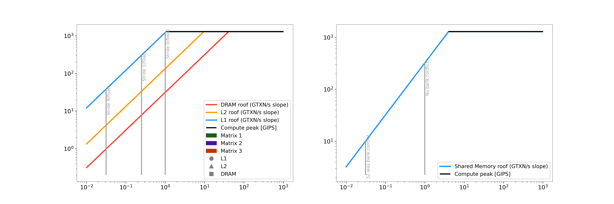
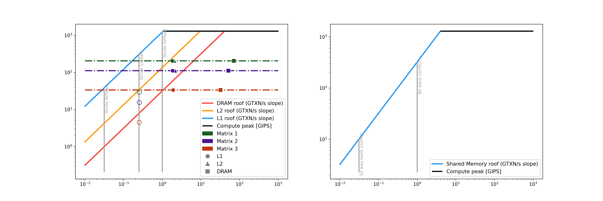
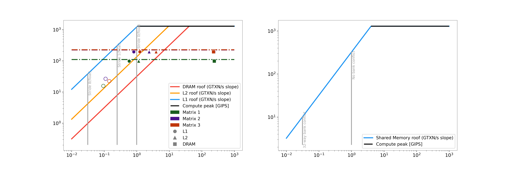

# Instruction Roofline-based Analysis of cuSPARSE and Ginkgo SpMM on RTX 4090
 
## 1. Overview
 
- Analyzes CSR-based SpMM kernels provided by cuSPARSE and Ginkgo using the Instruction Roofline model
- The following sources were used to collect metrics and hardware constants required for building a hierarchical Instruction Roofline on the RTX 4090:
  - (1) Official hardware documentation
  - (2) Benchmark paper (Luo et al., IPDPS 2024, arXiv:2402.13499)
  - (3) Nsight Compute 
- Analysis goes beyond simple runtime comparison by considering L1/L2/DRAM transactions, cache reuse, memory access patterns, and thread predication
---
 
## 2. Experiment Setup
 
| Item | Configuration |
|------|--------------|
| GPU | NVIDIA RTX 4090 (Ada Lovelace) |
| NVCC | 12.0 |
| Nsight Compute | 2026.1.1.0 |
| cuSPARSE | 12.7.10 |
| Ginkgo | 1.11.0 |
| Data Type | FP32 |
 
Three sparse matrices in `.smtx` format from the DLMC dataset were used. Matrix characteristics are as follows (`std_nnz`: standard deviation of nonzeros per row):
 
| ID | Rows | Columns | NNZ | Std NNZ | Color in Graph |
|----|------|---------|-----|---------|----------------|
| 1 | 512 | 1024 | 157,286 | 24.6081 | Green |
| 2 | 256 | 512 | 39,321 | 10.6942 | Purple |
| 3 | 128 | 256 | 9,830 | 7.49307 | Red |
 
---
## 3. Methodology

This project implements the Instruction Roofline model proposed by Ding & Williams (PMBS 2019).


### Axes
- **X-axis**: Instruction Intensity — instructions per transaction [inst/TXN]
- **Y-axis**: Achieved throughput [GIPS] (Giga Instructions Per Second)

### Ceilings
Three memory hierarchy ceilings are drawn based on measured bandwidth values:
- **L1 ceiling**: slope = L1 bandwidth [TXN/s]
- **L2 ceiling**: slope = L2 bandwidth [TXN/s]
- **DRAM ceiling**: slope = DRAM bandwidth [TXN/s]
- **Compute peak**: horizontal line = peak instruction throughput [GIPS]

### Transaction counting
All transactions are normalized to 32B sectors:
- Global memory(L1): `l1tex__t_sectors` (32B/sector, ×1)
- Shared memory(L1): `l1tex__data_pipe_lsu_wavefronts` (128B/wavefront, ×4)
- L2: `lts__t_sectors` (32B/sector, ×1)
- DRAM: `dram__sectors` (32B/sector, ×1)

- L1 Instruction Intensity is computed as: tx_l1 = global_sectors + 4 × shared_wavefronts

### Data points
- **Solid dot**: total instruction throughput vs. memory-level Instruction Intensity
- **Open dot**: global ld/st instruction throughput vs. L1 Instruction Intensity — indicates global memory access pattern efficiency
- **Dashed line**: warp-level throughput — gap with solid dot indicates thread predication

### global Memory walls
Vertical lines indicate theoretical Instruction Intensity bounds for different access patterns (float32):
- **Stride-0**: all threads access same address (Instruction Intensity = 1.0)
- **Stride-1**: coalesced access (Instruction Intensity = 0.25)
- **Stride-8**: strided access (Instruction Intensity = 0.03125)

---

## 4. Metrics and Instruction Roofline
 
Hardware ceilings are based on measured values from Luo et al. (arXiv:2402.13499), Table V.
 
| Parameter | Value | Source |
|-----------|-------|--------|
| L1 bandwidth | 121.2 B/clk/SM (FP32.v4) | Table V |
| L2 bandwidth | 1708.0 B/clk (FP32.v4) | Table V |
| DRAM bandwidth | 1008 GB/s | Official spec |
| Compute peak | 128 SM × 4 schedulers × 1 inst/cycle × 2.52 GHz | Official spec |
 
Metrics collected via Nsight Compute:
 
| Metric | Type | Unit | Description |
|--------|------|------|-------------|
| `smsp__inst_executed` | Counter | inst | # of warp instructions executed |
| `smsp__thread_inst_executed` | Counter | inst | # of thread instructions executed |
| `smsp__inst_executed_op_global_ld` | Counter | inst | # of warp instructions executed: LDG |
| `smsp__inst_executed_op_global_st` | Counter | inst | # of warp instructions executed: STG |
| `smsp__inst_executed_op_shared_ld` | Counter | inst | # of warp instructions executed: LDS |
| `smsp__inst_executed_op_shared_st` | Counter | inst | # of warp instructions executed: STS |
| `l1tex__t_sectors_pipe_lsu_mem_global_op_ld` | Counter | sector | # of sectors requested for global loads |
| `l1tex__t_sectors_pipe_lsu_mem_global_op_st` | Counter | sector | # of sectors requested for global stores |
| `l1tex__data_pipe_lsu_wavefronts_mem_shared_op_ld` | Counter | - | # of shared memory wavefronts processed by Data-Stage for LDS, LD, 3D |
| `l1tex__data_pipe_lsu_wavefronts_mem_shared_op_st` | Counter | - | # of shared memory wavefronts processed by Data-Stage for STS, ST, 3D |
| `lts__t_sectors_op_read` | Counter | sector | # of LTS sectors for reads |
| `lts__t_sectors_op_write` | Counter | sector | # of LTS sectors for writes |
| `dram__sectors_read` | Counter | sector | # of sectors read from DRAM |
| `dram__sectors_write` | Counter | sector | # of sectors written to DRAM |
---
 
## 5. How to Reproduce
 
```bash
# 1. Install Ginkgo
# Follow instructions at https://github.com/ginkgo-project/ginkgo
 
# 2. Clone this repository
git clone https://github.com/acornjelly2205/Instruction_Roofline_Analysis.git
cd Instruction_Roofline_Analysis
 
# 3. Place your sparse matrix in .smtx format under dataset/
 
# 4. Build
/bin/bash build.sh
 
# 5. Run experiment (collect ncu metrics)
/bin/bash experiment.sh

#6. Insert Kernel runtime
Insert kernel runtime(result/*_result.csv) measured by experiment.sh into Roofline/draw_Roofline.py

# 7. Draw Roofline
python3 ./Roofline/draw_Roofline.py
```
 
---
 
## 6. Results and Key Observations
 
### cuSPARSE SpMM (CSR, alg=CUSPARSE_SPMM_ALG_DEFAULT)
 

 
- **L2-bound** — L2 triangles (▲) are located near the L2 ceiling
- **Minimal L1 cache reuse** — L1 (●) and L2 (▲) points are nearly overlapping
- **Effective L2 reuse** — large gap between L2 (▲) and DRAM (■)
- **Efficient memory access pattern** — open dots (global ld/st only) are located near Stride-1 wall, indicating near unit-stride access
- **No thread predication** — warp-level throughput line and thread-level points nearly coincide
- **No shared memory usage**
### Ginkgo SpMM (CSR)
 

 
- **L1 memory-bound** — points are located below the L1 ceiling
- **L1 cache reuse present** — visible gap between L1 (●) and L2 (▲) points
- **L2 reuse present** — large gap between L2 (▲) and DRAM (■)
- **Inefficient memory access pattern** — open dots fall between Stride-8 and Stride-1 walls
- **Slight thread predication** — small gap between warp-level throughput line and thread-level points
- **No shared memory usage**
---

## 7. Optimization Implications

| Observation | Possible Cause | Possible Optimization Direction |
|---|---|---|
| L1/L2 transaction-side bottleneck | Inefficient global memory access pattern | Improve data layout, row grouping, or workload mapping |
| Open ld/st points away from unit-stride | Non-coalesced or irregular access | Reorder rows, change sparse format, improve dense matrix access locality |
| Lower instruction throughput | Instruction overhead or dependency stalls | Reduce index computation, specialize kernels, improve scheduling |
| Predication observed | Branching or workload imbalance | Reduce divergence, improve row/warp assignment |

---

## 8. Limitations

- This analysis is based on three sparse matrices and should not be interpreted as a universal ranking of cuSPARSE and Ginkgo.
- The current study focuses on CSR SpMM on RTX 4090. Results may differ for other sparse formats, matrix distributions, dense matrix widths, and GPU architectures.
- Instruction Roofline is a compact visual model and does not replace full microarchitectural profiling.
- The interpretation depends on correct Nsight Compute metric selection, transaction definitions, and architecture-specific ceiling values.

---

## 9. Acknowledgements
This repository is based on research conducted at Chung-Ang University HPC Lab.
The original work was published as:

> Inseo Kim, Jinsung Kim. "Performance Evaluation of Sparse Matrix–Matrix Multiplication Kernels Using a Hierarchical Roofline Model." ICTC 2025.

This repository presents an improved methodology with corrected hardware constants and metrics based on Luo et al. (arXiv:2402.13499).

---

## 10. References
 
- Nan Ding, Samuel Williams. "An Instruction Roofline Model for GPUs." IPDPSW, 2019.
- Weile Luo et al. "Benchmarking and Dissecting the Nvidia Hopper GPU Architecture." IPDPS 2024, arXiv:2402.13499, 2024.
- Eunji Lee, Yoonsang Han, Gordon Euhyun Moon. "Accelerated Block-Sparsity-Aware Matrix Reordering for Leveraging Tensor Cores in Sparse Matrix-Multivector Multiplication." Euro-PAR 2024. https://doi.org/10.5281/zenodo.11579181
